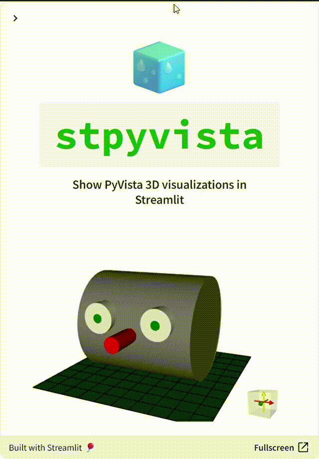

# 🧊 `stpyvista`

## Show PyVista 3D visualizations in Streamlit

<center>
<a href="https://stpyvista.streamlit.app"></a>

<a href="https://github.com/edsaac/stpyvista"></a> [](https://pypi.org/project/stpyvista/) <a href="https://github.com/edsaac/stpyvista-tests"></a>



</center>

This is a simple component that takes a PyVista plotter object and shows it on Streamlit as an interactive element (as in it can be zoomed in/out, moved and rotated, but the visualization state is not returned). It uses [Panel](https://panel.holoviz.org/reference/panes/VTK.html#working-with-pyvista) to render PyVista plotter objects within an iframe.

******
## Installation 

```sh
pip install stpyvista
```

******

## Check app demo with examples at [https://stpyvista.streamlit.app](https://stpyvista.streamlit.app)

******

<details>
<summary>
Basic example
</summary>
  
```python
import streamlit as st
import pyvista as pv
from stpyvista import stpyvista

## Initialize a plotter object
plotter = pv.Plotter(window_size=[400,400])

## Create a mesh with a cube 
mesh = pv.Cube(center=(0,0,0))

## Add some scalar field associated to the mesh
mesh['myscalar'] = mesh.points[:, 2]*mesh.points[:, 0]

## Add mesh to the plotter
plotter.add_mesh(mesh, scalars='myscalar', cmap='bwr', line_width=1)

## Final touches
plotter.view_isometric()
plotter.add_scalar_bar()
plotter.background_color = 'white'

## Pass a key to avoid re-rendering at each time something changes in the page
stpyvista(plotter, key="pv_cube")
```
</details>

****

#### Also check:
* The PyVista project at [https://www.pyvista.org/](https://www.pyvista.org/)
* Working with Panel and Pyvista [https://panel.holoviz.org](https://panel.holoviz.org/reference/panes/VTK.html#working-with-pyvista)
* @blackary['s blog post](https://blog.streamlit.io/how-to-build-your-own-streamlit-component/) on how to build a custom component
* Other stuff from me on [https://edsaac.github.io](https://edsaac.github.io)
