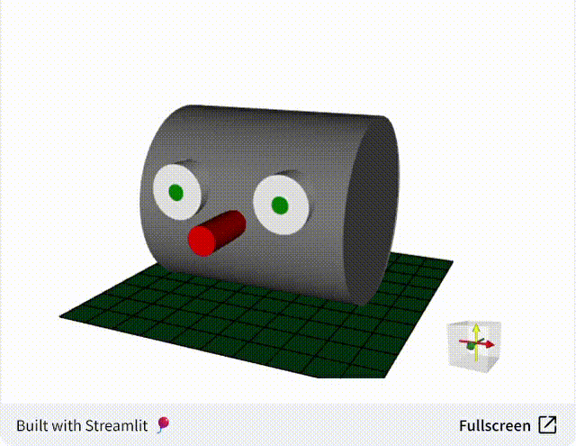

<h1 align="center">
  <b>🧊 <code>stpyvista</code></b>
</h1>

<h3 align="center">
  Show <a href="https://docs.pyvista.org/index.html">PyVista</a> visualizations in Streamlit.
</h3>

<p align="center">
<a href="https://stpyvista.streamlit.app/"></a> 
</p>

<p align="center">
<a href="https://github.com/edsaac/stpyvista"></a> 
<a href="https://pypi.org/project/stpyvista/">
<a href="https://github.com/edsaac/stpyvista-tests"></a>
</p>
  
<p align="center">
<a href="https://stpyvista.streamlit.app"></a>
</p>

Take a PyVista plotter object and show it on Streamlit as an interactive<em>-ish</em> component (as in it can be zoomed in/out, moved and rotated, but the visualization state is not returned). It uses [Panel](https://panel.holoviz.org/reference/panes/VTK.html#working-with-pyvista) to render PyVista plotter objects within an iframe.

******
### 📦 Installation 

```sh
pip install stpyvista
```

******

### 📚 Demo and documentation 

<a href="https://stpyvista.streamlit.app/"></a> 

******

### ✨ Minimal example
<details>
<summary>
<b>Render a cube</b>
</summary>
  
```python
import streamlit as st
import pyvista as pv
from stpyvista import stpyvista

## Initialize a plotter object
plotter = pv.Plotter(window_size=[400,400])

## Create a mesh with a cube 
mesh = pv.Cube()

## Add some scalar field associated to the mesh
mesh['my_scalar'] = mesh.points[:, 2] * mesh.points[:, 0]

## Add mesh to the plotter
plotter.add_mesh(mesh, scalars='my_scalar', cmap='bwr')

## Final touches
plotter.view_isometric()
plotter.add_scalar_bar()
plotter.background_color = 'white'

## Pass a key to avoid re-rendering at each page change
stpyvista(plotter, key="pv_cube")

```
</details>

****

### 🎈 Deploying to Streamlit Community Cloud

- By default, Community Cloud will run Python 3.12 🎈. Check this on New App → Advanced settings... → Python version.
- Add `stpyvista` to the `requirements.txt` file.
- Install `procps`, `libgl1-mesa-glx` and `xvfb` by adding them to the `packages.txt` file.
- The Community Cloud is a Debian headless machine and Pyvista requires a virtual framebuffer to work. `stpyvista.utils.start_xvfb` checks if Xvfb is running and [starts it](https://docs.pyvista.org/version/stable/api/utilities/_autosummary/pyvista.start_xvfb) if it was not. 

  ```python
  from stpyvista.utils import start_xvfb

  if "IS_XVFB_RUNNING" not in st.session_state:
    start_xvfb()
    st.session_state.IS_XVFB_RUNNING = True 
  ```

****

### 🚩 Known issues
- [ ] [**`cadquery`**](https://github.com/edsaac/stpyvista/issues/25) conflicts: `cadquery` bundles an outdated version of `vtk`, which ends up conflicting with the `vtk` version that `pyvista` requires. Current solution is to install `stpyvista` **before** cadquery in a virtual environment. 
- [ ] [`NSInternalInconsistencyException`](https://github.com/edsaac/stpyvista/issues/14) thrown when running on macOS. Current solution is to deploy using a VM.

#### 🍹 Solved issues 
- [x] [`RuntimeError`](https://github.com/edsaac/stpyvista/issues/17) thrown when running Python 3.9. Upgrading to `panel>=1.4.0` or using Python 3.10 fixes this.
- [x] [Buggy colormaps](https://github.com/edsaac/stpyvista/issues/19) when using `panel==1.4.0`. This [issue](https://github.com/holoviz/panel/issues/6627) was fixed with `panel==1.4.1`.
- [x] [`cmocean==4.0.1`](https://github.com/matplotlib/cmocean/releases/tag/v4.0.1) will raise an exception while trying to register its colormaps to matplotlib, making PyVista to crash. This [issue](https://github.com/matplotlib/cmocean/issues/107) was fixed in `cmocean==4.0.3`.
      
****

### 🍏 Also check
* The PyVista project at [https://www.pyvista.org/](https://www.pyvista.org/)
* Working with Panel and Pyvista [https://panel.holoviz.org](https://panel.holoviz.org/reference/panes/VTK.html#working-with-pyvista)
* @blackary['s blog post](https://blog.streamlit.io/how-to-build-your-own-streamlit-component/) on how to build a custom component
* Other stuff from me on [https://edsaac.github.io](https://edsaac.github.io)
